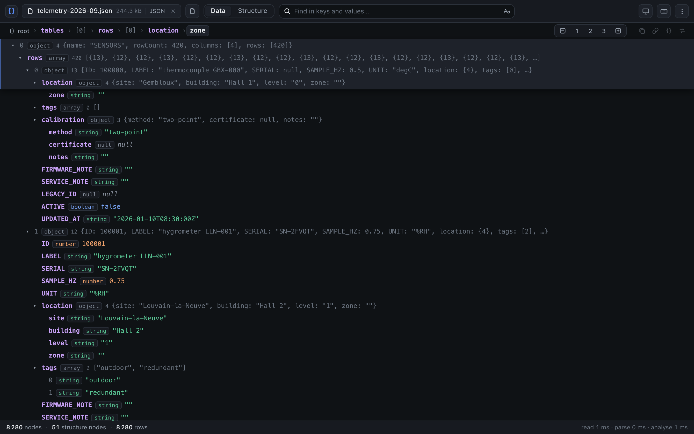
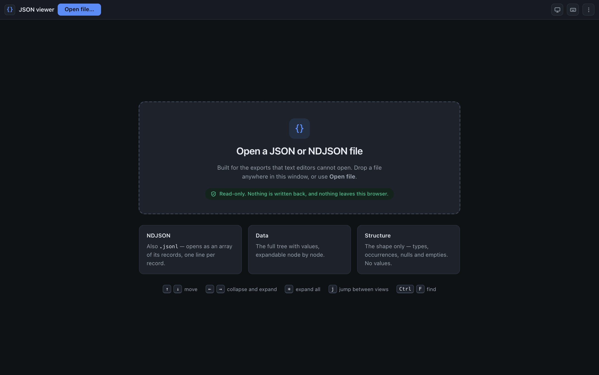
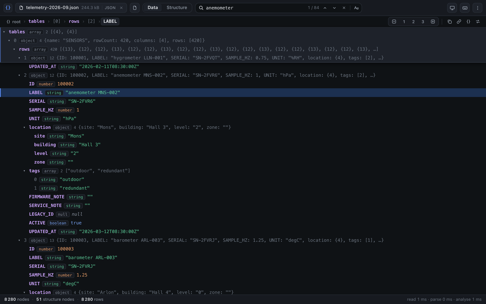
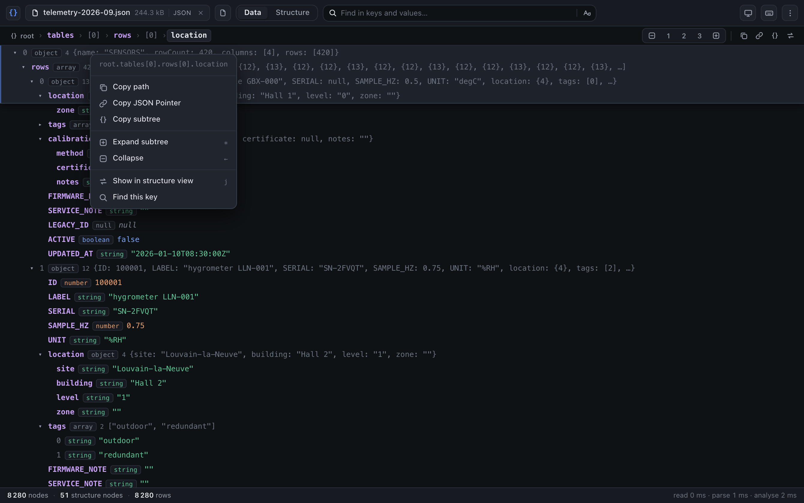
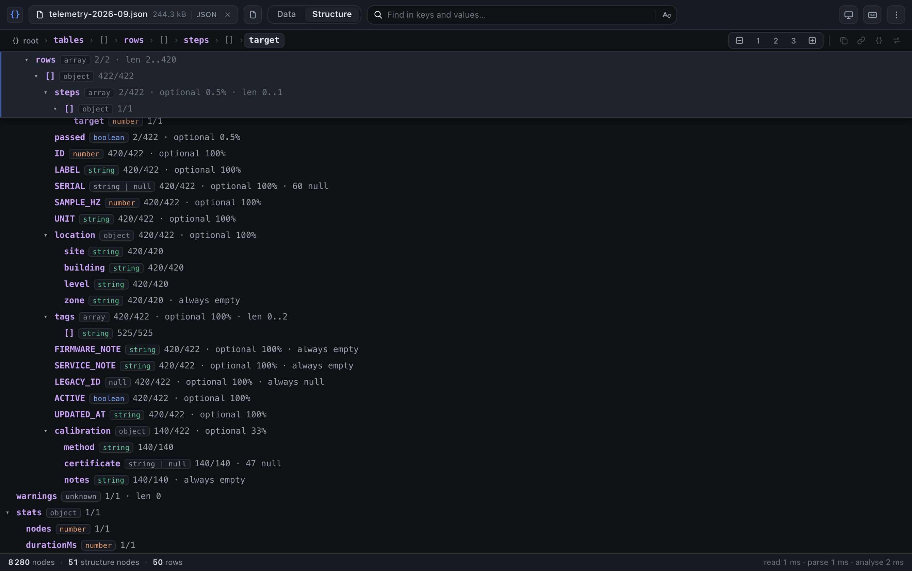
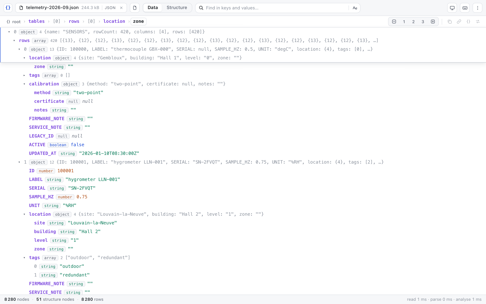
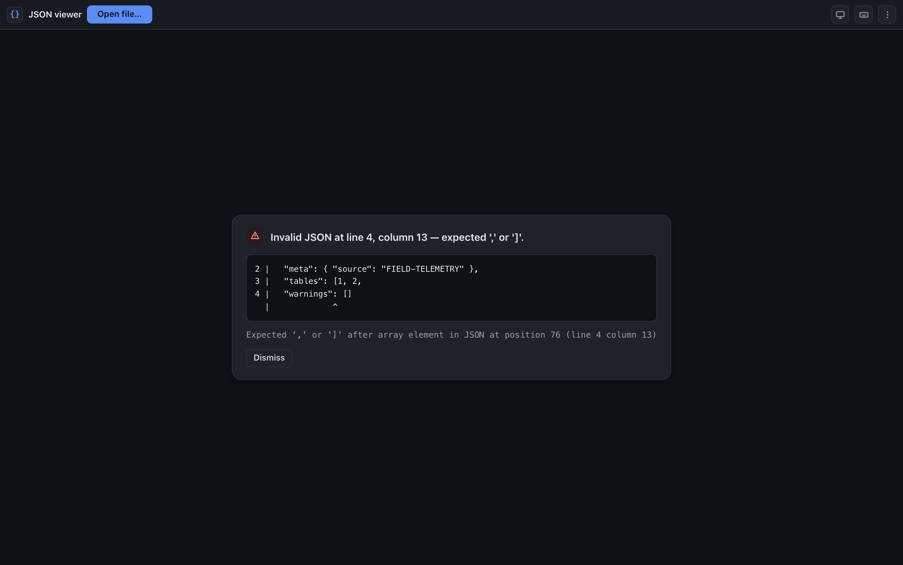

# JSON viewer

A read-only, browser-based viewer for large JSON and NDJSON files. Built for export
files that text editors and pretty-printers cannot navigate — the reference case
is a **56 MB / 2,054,886-line** export containing **1,867,216 JSON nodes**.

Angular 22 (dev server: Vite 8, via `@angular/build:application`).
`@angular/cdk` for virtual scrolling; no other runtime dependency.



> The screenshots show a synthetic sensor-fleet export generated by
> `scripts/shoot-docs.mjs`. No real export data has ever been in this
> repository.

---

# User guide

## Opening a file

Drop a file anywhere in the window, or use **Open file…**. Nothing is uploaded:
the file is read in the browser and never leaves it.



`.json`, `.ndjson`, `.jsonl` and `.jsonlines` all open. A file over ~512 MB is
refused up front rather than failing halfway (see *Two hard limits*, below), and
one over 200 MB asks before it commits the memory.

Once a file is open its name, size and format sit in the chip at the top left.
The `×` on the chip closes it and releases the memory; the button beside it
opens another.

## Moving around

The tree starts collapsed. Click a row to open or close it, or use the depth
control at the right of the second bar:

| Control | Effect |
|---|---|
| ⊟ | Collapse everything |
| 1 2 3 | Open exactly that many levels |
| ⊞ | Open everything (capped — see the row limit below) |

A container with more than 10,000 children gets a **show more** row instead of
being expanded wholesale; it reveals another 10,000, or all of them.

### Knowing where you are

Two things keep the context visible, and they always agree with each other:

- **The pinned ancestors.** The branch you are inside stays stuck to the top of
  the viewport. Click any pinned row to jump back to it.
- **The breadcrumb**, in the second bar. It follows the keyboard cursor when
  there is one and the top of the viewport otherwise, so it says something
  useful whether you are navigating by keyboard or just scrolling. Every segment
  is clickable.

In the screenshot at the top of this page, the pinned stack reads
`0 › rows › 0 › location` and the breadcrumb reads
`root › tables › [0] › rows › [0] › location › zone` — the same position, one as
the branch you are in, the other as the full path to the first row you can
read.

Pinning can be turned off from the **⋮** menu.

## Searching

The search field is always there. <kbd>Ctrl/Cmd</kbd>+<kbd>F</kbd> focuses it.



Type and the whole document is scanned — keys and values, not just the rows on
screen. <kbd>Enter</kbd> goes to the next match, <kbd>Shift</kbd>+<kbd>Enter</kbd>
to the previous, and the chevrons do the same. Matches stay highlighted in the
tree, the current one more strongly, and the ancestors of a hit are opened for
you.

The **Aa** button sets what is searched: keys, values, and whether case matters.

Above 5,000 hits the viewer stops collecting them but still reports the true
total, so `3 / 5,000 of 418,916` means what it says.

## Acting on a node

The same set of actions is available three ways, so you can reach them from
wherever your hands are:

- **Hover a row** — a small cluster appears at its right edge.
- **Right-click a row**, or press <kbd>Shift</kbd>+<kbd>F10</kbd>, for the full
  menu, with the node's path at the top.
- **The right of the second bar** — the same actions for the row the cursor is on.



| Action | What you get |
|---|---|
| Copy path | `root.tables[0].rows[0].location` — paste it into a console |
| Copy JSON Pointer | `/tables/0/rows/0/location` — RFC 6901, for interchange |
| Copy subtree | That node's value as pretty-printed JSON |
| Expand subtree | Opens everything beneath this one node |
| Collapse | Closes it |
| Show in structure view | The matching position in the other view |
| Find this key | Searches for this key name everywhere else |

Copying a subtree is refused above 200,000 nodes or 8 MB, with a message saying
so — the clipboard cannot take it, and the check happens *before* serialising so
you do not wait for a string that will be thrown away.

## The structure view

The **Structure** tab answers a different question: not *what is in this file*
but *what shape is it*. It shows types, how often each field occurs, how many
are null or empty, and array length ranges — and no values at all.



This is what makes a large export auditable. On the reference file it collapses
1.87M nodes into **230 rows**, and the read is immediate: in the screenshot
above, `zone`, `FIRMWARE_NOTE`, `SERVICE_NOTE` and `notes` are present on every
record and *always an empty string*; `LEGACY_ID` is *always null*; `calibration`
exists on only 33% of records; `SERIAL` is `string | null` with 60 nulls.

Press <kbd>j</kbd> to jump between the two views at the same position — from a
value to its field's statistics, or from a field to its first real occurrence.

Read the numbers as:

| Shown | Means |
|---|---|
| `420/422` | The field occurred 420 times, out of 422 parent objects |
| `optional 33%` | It is missing from two thirds of them |
| `always null` | Every occurrence was `null` — distinct from being absent |
| `always empty` | Every occurrence was `""` |
| `len 0..4` | Arrays here ran from empty to four elements |
| `string \| null` | Both types were observed at this position |

## Keyboard

| Key | Action |
|---|---|
| <kbd>↑</kbd> <kbd>↓</kbd> | Move |
| <kbd>→</kbd> | Expand, or step into the first child |
| <kbd>←</kbd> | Collapse, or step out to the parent |
| <kbd>Enter</kbd> <kbd>Space</kbd> | Toggle |
| <kbd>Home</kbd> <kbd>End</kbd> | First / last row |
| <kbd>PageUp</kbd> <kbd>PageDown</kbd> | One screen |
| <kbd>*</kbd> | Expand all |
| <kbd>j</kbd> | Jump to the other view |
| <kbd>Ctrl/Cmd</kbd>+<kbd>F</kbd> | Focus the search field |
| <kbd>Shift</kbd>+<kbd>F10</kbd> or <kbd>Menu</kbd> | Open the row's action menu |

<kbd>Ctrl/Cmd</kbd>+<kbd>F</kbd> deliberately shadows the browser's own find,
which would only see the ~40 virtualised rows that exist in the DOM and is
therefore actively misleading. For the same reason, copy actions are explicit
buttons: <kbd>Cmd</kbd>+<kbd>A</kbd> in a virtualised list would copy 40 rows.

The tree is a **single tab stop** using `aria-activedescendant`: 400,000
focusable rows would be unusable, and only ~40 of them exist in the DOM at any
moment. The hover cluster on a row is therefore `aria-hidden`, and every action
it offers is also on <kbd>Shift</kbd>+<kbd>F10</kbd> and in the context bar.

## Light and dark

The viewer follows the operating system by default. The sun/moon button cycles
system → light → dark, and the choice is remembered.



## When a file will not open

A syntax error is located by the viewer's own scanner and shown with the lines
around it and a caret on the exact column:



The line beneath is the engine's own message, kept because it is occasionally
more specific — but the line, column and frame above it come from
`core/json-locate-error.ts`, because V8's message frequently carries no position
at all.

For NDJSON the line number is the one **in the file**, not in the failing
record.

## What it deliberately does not do

It is a viewer. There is no editing, no reformatting or minifying, no
download or export, no JSONPath or jq query, no schema validation, no diff, and
no history of files you opened. Nothing is persisted except your theme choice.

## Two formats

| Format | Read as |
|---|---|
| **JSON** | The document itself. |
| **NDJSON** — one JSON value per line, also called `.jsonl` | An **array of its records**, so both views, search and the paths work on it unchanged. |

The extension only decides which format is *tried first*; the content decides
the rest. An NDJSON export someone saved as `.json` opens, and so does a single
pretty-printed document named `.ndjson`. A file that is simply broken keeps the
error for the format its name announced, rather than being accused of being the
other one.

NDJSON errors are reported at the **line number of the file**, not of the
record: the failing line is validated on its own, then the position is rebased
on the document so the caret frame shows the records around it.

Blank lines are ignored, a UTF-8 BOM is stripped, and CRLF files — which is how
the real exports arrive — read the same as LF ones.

## The source file is never modified

Files are read through `<input type="file">` and drag-and-drop only. There is no
File System Access handle, no `createWritable`, and no network request anywhere
in the application — the code has no write path at all. Nothing leaves the
browser.

---

# How it is built

## Measured behaviour on the 56 MB reference file

| Operation | Measured |
|---|---|
| Read (off-thread) | ~40–90 ms |
| `JSON.parse` | **~67 ms** |
| Structure inference (full scan, no sampling) | ~48 ms |
| Parsed graph in heap | ~38 MB (smaller than the 107 MB source string, which is released) |
| Flatten, typical interaction | 0.1–1.3 ms |
| Flatten, expand-all (capped) | ~14 ms |
| Full-text search over keys and values | ~65–75 ms |
| Locate a syntax error in a corrupt file | ~137 ms |

Because the whole load blocks for roughly 115 ms, there is **no Web Worker**: a
`postMessage` protocol, async child fetching and a page cache would add
permanent complexity to hide a delay nobody can perceive, and `structuredClone`
of the parsed graph alone costs more than parsing it again.

## Two hard limits worth knowing

1. **~512 MB of text.** A JS engine cannot hold a string longer than 536,870,888
   characters, so a larger file cannot be decoded at all — in a worker or
   anywhere else. Files above it are refused up front with a clear message
   instead of failing with a `RangeError`.
2. **Browsers clamp element height** (~33.5M px in Chromium/WebKit, ~17.9M px in
   Gecko). A fixed-size virtual scroller's spacer *is* one very tall element, and
   past the clamp the viewport silently cannot reach its own bottom — rows exist
   but are unreachable and nothing throws. The limit is therefore measured at
   runtime (`core/scroll-limits.ts`) and converted into a row cap; hitting it
   shows a banner rather than losing rows quietly.

## The interface

Three bars and a tree. What is deliberate about it:

- **Pinned ancestors.** The branch you are inside stays stuck to the top of the
  viewport, at the same 24px geometry as the rows. The rule is one sentence:
  *pin the ancestors of the first row that will be visible below the stack* —
  solved in `core/sticky.ts`, capped at five levels and at half the viewport.
  Cost is O(depth), never O(rows), and it runs once per row crossed rather than
  per frame, because `scrolledIndexChange` only fires when the top row changes.
  Like every sticky-scroll implementation this occludes the rows just under the
  top edge; what it guarantees is that everything pinned is a true ancestor of
  the first row you can read.
- **A clickable breadcrumb** describes that same first readable row, or the
  cursor when there is one. It elides its middle rather than scrolling sideways.
- **One action catalogue, three ways in.** Copy path / pointer / subtree, expand
  a subtree, jump to the other view and find-this-key all come from
  `state/node-actions.ts`, offered in the context bar, on row hover, and by
  right-click. Nothing that acts on the cursor sits in the top bar, so no button
  there spends its life disabled.
- **Search is a field, not a drawer.** On a two-million-line export it is the
  primary tool; having to summon it before you can see whether anything matched
  is the wrong shape.
- **The 24px row is load-bearing.** `--row-height` must stay exactly equal to
  `ROW_HEIGHT` in `state/viewer.store.ts`, and a row must never wrap or gain
  vertical padding — the CDK's fixed-size strategy trusts `itemSize`, and drift
  makes the bottom of the list silently unreachable. That is why the hover
  cluster is absolutely positioned and the pinned stack is a sibling overlay
  rather than anything inside the viewport.
- **Colours are declared once**, with `light-dark()` in `styles.css`; the theme
  toggle only narrows `color-scheme`, and the choice is remembered.

## How it works

The core (`src/app/core/`) is pure and Angular-free — thirteen modules that take
a value and return data, so they are testable without a browser. The interface
decisions live there too: which ancestors to pin, where to scroll so a row is
not hidden under them, and where a menu fits on screen are all arithmetic, and
all unit-tested without a DOM.

- **No node objects.** The parsed value *is* the tree. Rows hold a live
  reference into it and are recomputed from scratch on every expand/collapse
  (36–85 ms worst case), which removes every cache-coherence bug a node layer
  would introduce.
- **Expansion is keyed by object identity**, never by a string path. `JSON.parse`
  never produces aliased references, so identity is a perfect key — and since no
  code ever parses a path, keys containing `.`, `[`, `]`, `"`, `/`, `~` or
  newlines cannot break navigation. Paths are *derived* for display only, in both
  JSON Pointer (RFC 6901) and JavaScript-accessor form.
- **`autoExpandDepth` is a rule, not an enumeration**, so "expand all" and
  "expand to depth N" are O(1) instead of materialising a set of all 93,758
  containers.
- **Large containers get a "show more" row** rather than synthetic bucket nodes.
  A bucket would be a node that does not exist in the document, which every
  path, search result and keyboard move would then have to model.
- **Syntax errors are located by our own scanner** (`core/json-locate-error.ts`),
  because V8's `SyntaxError` message cannot be relied on: the most common form
  (`Unexpected token '}' …`) carries no position at any input size. The scanner
  allocates nothing per character and reports an exact line, column and caret
  frame. It runs only after a parse has already failed.

## Running it

One command. It installs npm dependencies if they are missing or stale, finds a
free port, and starts the dev server:

```bash
./start.sh
```

There is nothing else to start — no backend, no database, no services.

| Option | Effect |
|---|---|
| `-p, --port N` | Preferred port (default 4200; the next free one is used if taken) |
| `-n, --no-open` | Do not open a browser |
| `-f, --fixture` | Also generate a ~59 MB synthetic test fixture (see below) |
| `-c, --clean` | Reinstall `node_modules` from scratch first |
| `-b, --build` | Produce a production build instead of serving |
| `-t, --test` | Run the unit tests first |
| `-h, --help` | Show help |

To try the viewer at full scale immediately:

```bash
./start.sh --fixture
```

then open `large.json` from `public/fixtures/` in the file picker.

The underlying npm scripts remain available:

```bash
npm start          # dev server (Vite)
npm test           # unit tests (Vitest) — 212 tests
npm run build      # production build
```

### As a container

The image is a static nginx serving the production build — no Node, no backend,
nothing to configure:

```bash
docker run --rm -p 5176:80 pwarnon/json-viewer
```

`deploy.sh` builds it for `linux/amd64` and `linux/arm64` and pushes both to
Docker Hub under `pwarnon` (a `docker login` is required first):

```bash
./deploy.sh          # pwarnon/json-viewer:latest
./deploy.sh 1.1.1    # :1.1.1 and :latest
```

The build resolves every dependency from the public npm registry, so it needs
no private mirror and no credentials — the versions and `integrity` hashes are
the lockfile's. The 59 MB fixture in `public/fixtures/` is excluded by
`.dockerignore`, as is `docs/`; the image serves 252 KB.

The image is also meant to be mounted by a wider `docker compose` stack, which
is why the examples above map it to port **5176**.

### As a desktop application

`desktop/` wraps the production build in Electron: an application that opens
from the Dock or the taskbar, with no Docker, no server and no browser to
start. It is Chromium underneath, so the size limits and memory figures above
hold unchanged, and the page is the same build the container serves — no
preload, no Node in the page, nothing added to the Angular code.

| Command | Produces |
|---|---|
| `./desktop/build.sh --install` | `JSON Viewer.app` for this Mac, copied to `/Applications` |
| `./desktop/build.sh --dmg` | `desktop/out/JSON Viewer-<version>.dmg`, to install on another Mac |
| `./desktop/build.sh --windows` | `desktop/out/JSON Viewer-<version>-win32-x64.zip`, with `JSON Viewer.exe` |

All three are built on a Mac. Without an option, the app is only left in
`desktop/out/`; `--install` and `--dmg` combine. After installing, open the
app once, then right-click its Dock icon › Options › Keep in Dock.

- **This Mac.** Packaged for its own architecture, signed ad hoc, and copied to
  `/Applications` (or `~/Applications` when `/Applications` is not writable).
  Built where it runs, it opens directly. About 290 MB, nearly all of it the
  Electron runtime; the viewer itself is 280 KB.
- **Another Mac.** The DMG (~220 MB) holds a universal app — Intel and Apple
  Silicon, macOS 13 or later — an `Applications` shortcut to drag it onto, and
  a `LISEZ-MOI.txt`. The app is not notarised, so macOS blocks its first launch
  on a Mac that downloaded it: open it once, then System Settings › Privacy &
  Security › Open Anyway — or clear the quarantine flag:

  ```bash
  xattr -dr com.apple.quarantine "/Applications/JSON Viewer.app"
  ```

- **Windows 10 and 11, 64-bit.** The zip (~160 MB) holds a folder to extract —
  `JSON Viewer.exe` needs the DLLs next to it — and a `LISEZ-MOI.txt`. The exe
  is not signed, so SmartScreen warns on first launch: More info › Run anyway.
  It is built from macOS without Wine, and its `resources/app.asar` is
  byte-identical to the macOS build's.

A second launch while the app is running opens another window in it, rather
than a second process, which would find the profile locked and could not save
the theme.

Electron is installed in `desktop/node_modules` on its own, so neither the
Angular project nor the image depends on it. `npm start` in `desktop/` runs
the window without packaging it, on `desktop/app/` — the copy of the build that
the last `build.sh` left there. The icons are generated from `desktop/icon.svg`
by `desktop/icons.sh`.

### Checking against a real large file

The reference export is **not** in this repository: it has no business in git. Point the verification script at it by path
instead. It checks every performance budget above and every structural
invariant:

```bash
node --expose-gc scripts/verify-real-file.mjs "/path/to/export.json"
```

To get a large file for browser testing without touching real data, generate a
shape-identical fixture. `test/fixtures/shape.json` carries the *structure*
only — how many tables, how many records in each, how many columns and of which
types. Table and column names are neutral placeholders, kept at the real names'
lengths so the generated file keeps its size, and no value was ever taken from
the real file. The generator reproduces the awkward parts of the real encoding
(UTF-8 BOM, CRLF, tab-before-comma, a few characters above U+00FF that force a
two-byte string):

```bash
node test/fixtures/gen-large.mjs public/fixtures/large.json
```

Generated fixtures live in `public/fixtures/` and are git-ignored.

### Regenerating the screenshots

The images in this README are produced from the **production build**, so they
show what ships rather than what the dev server renders:

```bash
npm run build && node scripts/shoot-docs.mjs
```

It drives a headless Chrome over the DevTools protocol with no dependency at
all — Node has had a WebSocket client built in since v22, and CDP is JSON over a
socket. Taking on a browser-automation stack just to photograph a project that
refuses runtime dependencies would have been a poor trade. The data in the
screenshots is generated by the script itself.
